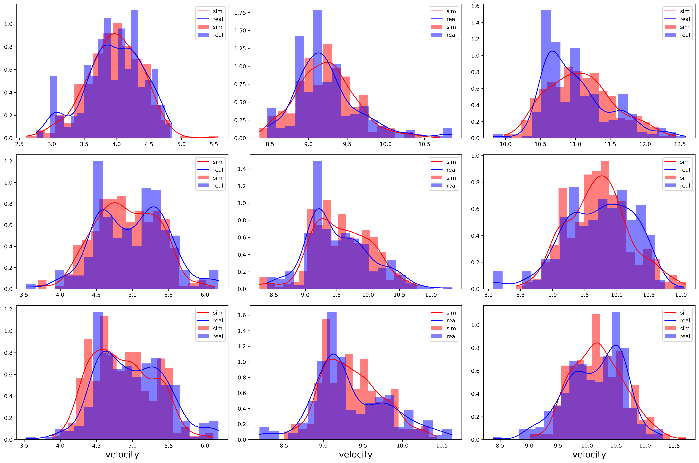

# e4040-2021Fall-SGAN-zm2302-yf2578
This is a project to reproduce the paper:
**<a href="https://arxiv.org/abs/1803.10892">Social GAN: Socially Acceptable Trajectories with Generative Adversarial Networks</a>**
<br>
<a href="http://web.stanford.edu/~agrim/">Agrim Gupta</a>,
<a href="http://cs.stanford.edu/people/jcjohns/">Justin Johnson</a>,
<a href="http://vision.stanford.edu/feifeili/">Fei-Fei Li</a>,
<a href="http://cvgl.stanford.edu/silvio/">Silvio Savarese</a>,
<a href="http://web.stanford.edu/~alahi/">Alexandre Alahi</a>
<br>
Presented at [CVPR 2018](http://cvpr2018.thecvf.com/)

In this paper, pedestrain trajectory is predicted using the social GAN model. The main contribution of this paper is that
it proposes "social-pooling" technique to consider neighbouring pedestrains when making prediction.

We make two modifications:
1. We change the application field from pedestrian trajectory prediction to human driving behavior prediction, which is a car-following modeling problem.
2. We partially implemented the GAN model without “social pooling” due to its complexity.

The reason for the 1st modification is because the original paper is too complex, which contains the GAN structure and “social-pooling”, and we focus on the GAN structure,
which is the main framework of the original paper. The reason for the 2nd modification is that we are with a transportation background and want to try to apply this method to our domain. 

We aims to use the GAN model to predict the car-following behavior considering human uncertainty, and the result is shown as below:
<div align='center'>
  
</div>

In the figure, the x-axis is the target velocity and the y-axis is its probability density. The red and blue curves are the results of the ground-truth and prediction, respectively. We can see that GAN model can fit the 
distribution of the car-following behavior very well.
# Code
This repo has two characteristics:
1. All procedures (training, testing, visualization) can be run in the terminal by scripts. Thus the notebook is very clean.
2. The result is "folder-based". Each folder in the experiments means contains all files related to this folder, including the configuration file, model weights,
test results, and visualization.

# How to reproduce

There are only 3 cells in the notebook that are enough to reproduce the results. The merit goes to the aforementioned 1st characteristic that all moudules are in script.
Instead of running the notebook, you can also run the following codes:
```bash
python main_lstm.py --experiment_dir experiments/ngsim/gan --data_dir data/ngsim/ngsim_v_dt=1 --mode train --force_overwrite
python main_lstm.py --experiment_dir experiments/ngsim/gan --data_dir data/ngsim/ngsim_v_dt=1 --mode test
python viz.py --experiment_dir experiments/ngsim/gan --sudoku --interval --metrics_statistic --force_overwrite
```

# Dataset
Raw dataset is stored in the folder "raw_data/NGSIM". It is a pickle file contains the trajectory information of the follower and the leader.
To convert the time-series trajectory to feature-label pairs, "build_ngsim_data.py" should be run:

```bash
python build_ngsim_data.py
```
This script will first load the "data_para.json" file that contains the data configuration like the training and test total size. Then the process data will
be save in the .csv file in the same location as the json file.

This step can be skipped as the processed data is in the repo.

# Model

  
# Detailed instructions how to submit this assignment/homework/project:
1. The assignment will be distributed as a github classroom assignment - as a special repository accessed through a link

2. A students copy of the assignment gets created automatically with a special name
3. Students must rename the repo per instructions below

4. The solution(s) to the assignment have to be submitted inside that repository as a set of "solved" Jupyter Notebook(s), and several modified python files which reside in directories/subdirectories

5. Three files/screenshots need to be uploaded into the directory "figures" which prove that the assignment has been done in the cloud

6. Code to be graded from github

7. If some model is too large for github- create google (liondrive) directory, upload, and share the link with E4040TAs@columbia.edu

8. Submit report as a pdf file, through courseworks upload, and also have the pdf report in the root of the github repo for the group


## (Re)naming of a project repository shared by multiple students (TODO students)
INSTRUCTIONS for naming the students' solution repository for assignments with several students, such as the final project. Students must use a 4-letter groupID, the same one that was chosed in the class spreadsheet: 
* Template: e4040-2021Fall-Project-GroupID-UNI1-UNI2-UNI3. -> Example: e4040-2021Fall-Project-MEME-zz9999-aa9999-aa0000.

# Organization of this directory
To be populated by students, as shown in previous assignments.
Create a directory/file tree
